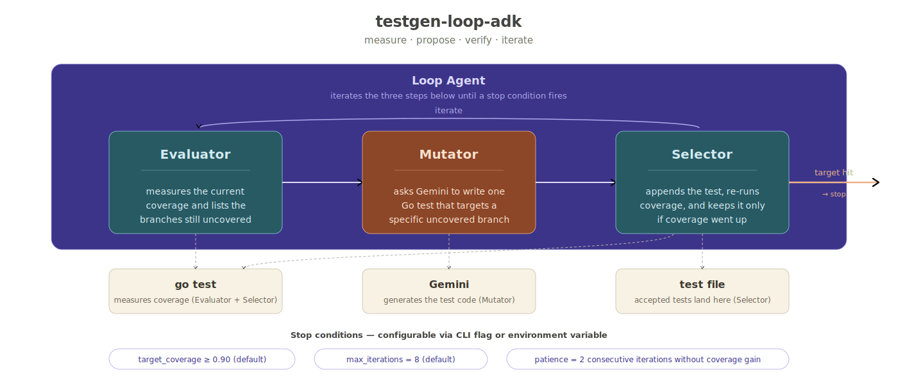

# testgen-loop-adk

[](https://golang.org)
[](https://github.com/google/adk-go)
[](https://ai.google.dev/)
[](LICENSE)

A goal-driven loop agent that writes Go unit tests for you — and keeps writing them until coverage hits the threshold you ask for. Built on [Google Agent Development Kit (ADK) for Go](https://github.com/google/adk-go) and [Gemini 2.5 Flash](https://ai.google.dev/), using a custom three-agent design (Evaluator → Mutator → Selector) wrapped in ADK's `LoopAgent`. Point it at a Go file, walk away, come back to a `_test.go` you can ship.

---

## Why testgen-loop-adk?

The way we work with LLMs is shifting. The first wave was **prompt engineering** — crafting the perfect single message to coax a model into doing what you wanted. The wave Anthropic has started calling **loop engineering** (or *harness engineering*) is fundamentally different. Instead of typing back and forth with a model, you write a small autonomous system with a measurable goal: observe a workspace, take one step, verify the result, repeat until the goal is met. Anthropic's own engineering teams have publicly said that **up to 80% of their production code now ships through pipelines built this way** — the human role is no longer writing prompts, it's designing the loops that prompt themselves.

`testgen-loop-adk` is a concrete, end-to-end example of that pattern — applied to a problem every Go developer recognizes.

Writing unit tests is the slow tax on shipping Go code. Write a function, then write five more functions just to prove it works. The branches, the boundary cases, the table-driven scaffolding — all mechanical work that takes longer than the code itself.

The obvious answer is *"just ask an LLM."* And the obvious problem is that LLM-generated tests look plausible without being right. Maybe they don't compile. Maybe they pass without exercising the branch you cared about. Maybe they duplicate a test you already had. Prompt engineering can sharpen the *question*, but it can never **verify** the answer — and verifying by hand defeats the point.

Loop engineering does. `testgen-loop-adk` is the loop:

1. **Measure** what coverage looks like right now.
2. **Ask Gemini** for exactly one test that targets a still-uncovered branch.
3. **Append** it, **run `go test`**, see if coverage actually went up.
4. **Keep it** if it did — **roll back** if it didn't, **stop** when the target is hit.

You get tests that compile, that pass, and that demonstrably moved the coverage needle. The verification is **built into the loop**, not bolted on after. The model is one component inside a system that checks its own work — the harness pattern that's becoming the way AI work actually gets done.

The project is built end-to-end on [Google ADK Go](https://github.com/google/adk-go) as a small, demoable proof that loop engineering is concrete and buildable today: an ADK `LoopAgent` composed with a real `LlmAgent` (the Mutator, powered by Gemini) and two custom agents (the Evaluator and Selector). Nothing fancy, nothing hidden — just the harness pattern written out in Go.

---

## Architecture



The whole flow runs inside a single ADK Loop Agent. Each iteration, three sub-agents run one after the other and share information through a session state they all read and write — they never call each other directly.

- **Evaluator** runs the existing test file, measures coverage, and writes the current coverage percentage plus the list of uncovered branches into state. Pure Go, no LLM.
- **Mutator** assembles a prompt from the target source, the uncovered list, and the names of already-accepted tests, then asks Gemini for exactly one new test function aimed at one of those uncovered branches. The response comes back into state as the candidate test code.
- **Selector** takes the candidate, snapshots the test file, appends the new function, runs `go test` again to see whether coverage actually went up, and either keeps the change or rolls it back. When coverage clears the target — or the patience budget is exhausted on a plateau — it signals the loop to stop.

The loop terminates the moment any of the three configurable stop conditions fires: target coverage hit, max iterations exhausted, or patience expired (N consecutive iterations with no coverage gain). All three are tunable via CLI flags or environment variables — see the [Configuration Reference](#configuration-reference) below.

Underneath, two plain-Go subsystems do the deterministic work: a coverage subsystem that wraps `go test -coverprofile=...` and parses the result, and a workspace subsystem that owns the test file with safe snapshot, append, and restore semantics so a bad LLM proposal never leaves the test file in a broken state. Session state lives in memory only — runs are self-contained and leave no external footprint.

---

## Demo Run

Pointed at the demo target `examples/classify/classify.go` — a 5-branch `Classify(int) string` function — the loop converges from **0% to 100%** in 5 iterations and ~13 seconds.

### Before the run

```go
// examples/classify/classify_test.go — pristine
package classify

import "testing"

func TestPlaceholder(t *testing.T) {}
```

Coverage: **0.0% (0/6 statements)**

### The command

```bash
export TESTGEN_GEMINI_API_KEY="…"
./bin/testgen-loop --target ./examples/classify/classify.go
```

### Watching one iteration (logs annotated)

Each iteration produces three coordinated bursts of log lines — Evaluator measures, Mutator calls Gemini, Selector verifies and accepts:

```jsonc
// Evaluator: measure baseline
{"msg":"evaluator baseline","iteration":1,"current_coverage":0,"uncovered_blocks":6}

// Mutator: Gemini proposes a test
{"msg":"mutator: gemini call complete","iteration":1,
 "response_preview":"func TestClassifyNegative(t *testing.T) { n := -1 want := \"negative\" ...",
 "prompt_tokens":679,"response_tokens":72,"total_tokens":1060,
 "model_version":"gemini-2.5-flash"}

// Workspace: snapshot then append
{"msg":"snapshot taken","depth":1}
{"msg":"test appended","test_name":"TestClassifyNegative","new_size":399}

// Coverage Runner: re-verify
{"msg":"coverage run complete","percent":33.33,"covered_stmts":2,"uncovered_blocks":4}

// Selector: gain confirmed → accept
{"msg":"snapshot discarded"}
{"msg":"selector: accepted","test_name":"TestClassifyNegative",
 "prev_coverage":0,"new_coverage":33.33,"delta":33.33}
```

Iterations 2 through 5 follow the same shape — each one targets a different uncovered branch, each one accepted with a fresh ~16.7-percentage-point delta.

### After the run

```go
// examples/classify/classify_test.go — after the loop
package classify

import "testing"

func TestPlaceholder(t *testing.T) {}

func TestClassifyNegative(t *testing.T) {
	n := -1
	want := "negative"
	got := Classify(n)
	if got != want { t.Errorf("Classify(%d) = %q, want %q", n, got, want) }
}

func TestClassifyZero(t *testing.T) {
	n := 0
	want := "zero"
	got := Classify(n)
	if got != want { t.Errorf("Classify(%d) = %q, want %q", n, got, want) }
}

func TestClassifySmall(t *testing.T) {
	n := 5
	want := "small"
	got := Classify(n)
	if got != want { t.Errorf("Classify(%d) = %q, want %q", n, got, want) }
}

func TestClassifyMedium(t *testing.T) {
	n := 50
	want := "medium"
	got := Classify(n)
	if got != want { t.Errorf("Classify(%d) = %q, want %q", n, got, want) }
}

func TestClassifyLarge(t *testing.T) {
	n := 100
	want := "large"
	got := Classify(n)
	if got != want { t.Errorf("Classify(%d) = %q, want %q", n, got, want) }
}
```

Coverage: **100.0% (6/6 statements)** — and notice Gemini picked `n = 100` for the "large" case, the precise boundary that would catch an off-by-one in the `case n < 100` condition. That kind of test-design instinct is exactly what made the loop pattern worth building.

### Run summary

```
=== Run Summary ===
target:           ./examples/classify/classify.go
iterations:       5 / 8
coverage:         0.0% -> 100.0% (target 90%)
stop reason:      target
duration:         13.444s
accepted tests:   5
  + TestClassifyNegative
  + TestClassifyZero
  + TestClassifySmall
  + TestClassifyMedium
  + TestClassifyLarge
rejected entries: 0
```

5 of 8 iterations consumed. Loop terminated because the Selector escalated when `current_coverage >= target_coverage * 100`. Zero rejections — Gemini hit every branch on the first try thanks to the strict prompt and the `cleanCandidateCode` defensive parser.

---

## Prerequisites

- Go 1.25+
- A free Google AI Studio API key — [get one here](https://aistudio.google.com/app/apikey)

---

## Setup

### 1. Clone and build

```bash
git clone https://github.com/tushariitr-19/testgen-loop-adk
cd testgen-loop-adk
make build
```

### 2. Configure

```bash
export TESTGEN_GEMINI_API_KEY="your_api_key_here"
```

### 3. Run

The CLI takes one required flag — the target file:

```bash
# Drive the full loop against your own code:
./bin/testgen-loop --target ./path/to/your/file.go

# Or try the bundled demo target:
./bin/testgen-loop --target ./examples/classify/classify.go
```

A run mutates the companion `*_test.go` file. To preview without invoking Gemini, use `--dry-run`:

```bash
./bin/testgen-loop --target ./examples/classify/classify.go --dry-run
```

`--dry-run` runs only the coverage subsystem and prints the report — no LLM call, no file changes.

---

## Project Structure

```
testgen-loop-adk/
├── cmd/testgen-loop/      ← entry point (router + final summary printer)
├── internal/
│   ├── agents/            ← Evaluator / Mutator / Selector + session-state contract
│   │   └── prompts/       ← embedded Gemini prompt template
│   ├── orchestrator/      ← wires the ADK tree and drives the runner
│   ├── coverage/          ← go test runner + profile parser (no LLM)
│   ├── workspace/         ← snapshot / append / restore / discard for test files
│   ├── config/            ← env + flag loading with precedence (flag > env > default)
│   └── logging/           ← JSON zap logger, ISO8601, stderr
├── examples/classify/     ← demo target — a 5-branch Go function
├── docs/architecture/     ← architecture.svg
└── Makefile
```

---

## Makefile Targets

```bash
make build            # Compile the binary into ./bin/
make run ARGS="..."   # Build and run with the supplied flags
make test             # Unit + integration tests (race detector on)
make vet              # go vet across the module
make fmt              # go fmt across the module
make tidy             # go mod tidy
make clean            # Remove bin/ and coverage artifacts
make help             # List all targets
```

---

## Configuration Reference

Every knob is settable via CLI flag **or** environment variable. Precedence is **flag > env > default**.

| Flag | Env Var | Default | Purpose |
|---|---|---|---|
| `--target`, `-t` | `TESTGEN_TARGET_FILE` | *(required)* | Go source file to generate tests for |
| `--model` | `TESTGEN_GEMINI_MODEL` | `gemini-2.5-flash` | Gemini model name |
| *(env only)* | `TESTGEN_GEMINI_API_KEY` | *(required for loop)* | Gemini API key |
| `--target-coverage` | `TESTGEN_TARGET_COVERAGE` | `0.90` | Stop once coverage reaches this fraction (0–1) |
| `--max-iterations` | `TESTGEN_MAX_ITERATIONS` | `8` | Hard cap on loop iterations |
| `--patience` | `TESTGEN_PATIENCE` | `2` | Stop after this many consecutive no-gain iterations |
| `--work-dir` | `TESTGEN_WORK_DIR` | system temp | Directory for intermediate artifacts |
| `--debug` | `TESTGEN_DEBUG` | `false` | Enable debug-level structured logging |
| `--dry-run` | — | `false` | Run coverage once and print the report, no LLM, no mutation |

---

## Design Decisions

**Three agents, one contract — session state.** Evaluator, Mutator, and Selector never call each other directly. They read and write the same set of session-state keys (`iteration`, `current_coverage`, `candidate_test`, `accepted_tests`, …), declared as constants in `internal/agents/state.go`. This is the heart of the ADK composition pattern: agents are stateless transformers over a shared bus.

**Transactional workspace.** The Workspace exposes a `Snapshot → AppendTest → Discard|Restore` API so every iteration is a transaction. A bad LLM proposal — invalid syntax, name collision, no coverage gain — triggers `Restore()` and the test file is byte-identical to its pre-iteration state. Acceptable proposals go through `Discard()` so the snapshot doesn't leak. The example test file in `examples/classify/` survives bad runs unchanged.

**Strict prompt, low temperature.** The Gemini prompt template (embedded via `go:embed` from `internal/agents/prompts/mutator.tmpl`) enforces seven output rules: one function only, name must start with `Test`, exact `func TestXxx(t *testing.T)` signature, no markdown fences, no prose, no imports beyond `testing`. Temperature 0.2 keeps output predictable. The defensive `cleanCandidateCode` strips fences anyway in case the model slips.

**`InstructionProvider` over ADK's `{key}` injection.** The Mutator could use ADK's built-in `{state_key}` placeholders in `Instruction`, but that forces state values to match the template literally — and our state holds `[]string` (accepted test names) that we want rendered as a comma-joined list. The `InstructionProvider` gives us full control over per-key formatting (slices → joined, percent → one decimal) without bending the state shape.

**JSON-only structured logging on stderr.** The whole binary uses zap with the production JSON encoder, ISO8601 timestamps, and `timestamp` as the key. Logs go to stderr; the final summary and the dry-run report go to stdout. That makes `./bin/testgen-loop … > summary.txt 2> logs.json` cleanly separate streams. `--debug` flips to debug level for the full prompt, full response, and per-step internal traces.

---

## Limitations (v1)

testgen-loop-adk v1 is a **scope-constrained showcase**, not a general-purpose test-generation product. The boundaries:

- **Single file, single function.** The Mutator's prompt assumes one target file with one function. Multi-function and multi-file targets work *technically* but the prompt won't pick branches across functions intelligently — that's v1.1 / v1.2.
- **Pure Go functions only.** Functions with external dependencies (HTTP, DB, time) need mocks the Mutator does not yet generate. Best results today are on pure logic functions (parsers, classifiers, calculators).
- **No concurrency.** One loop run at a time. The Workspace and Coverage Runner are not safe for parallel invocation.
- **Two coverage runs per iteration.** Evaluator measures the baseline; Selector re-measures after appending. ~2× the `go test` cost. Known trade-off in exchange for a clean three-agent demo; collapsing them is a Phase 5 optimization.
- **Tests are appended, never refactored.** Existing tests are preserved verbatim. The tool doesn't propose refactors or table-driven consolidations — it just adds.
- **No CI or web UI yet.** Pure CLI. A web demo via ADK's `cmd/launcher/full` is on the roadmap.

---

## Roadmap

- [x] Phase 0 — scaffolding (config, logging, Makefile)
- [x] Phase 1 — coverage subsystem (runner + parser via `golang.org/x/tools/cover`)
- [x] Phase 2 — workspace (snapshot/append/restore/discard)
- [x] Phase 3 — ADK three-agent loop with stub Mutator
- [x] Phase 4 — Gemini-backed Mutator (`LlmAgent`) with prompt template, `OutputKey`, fence-stripping cleaner, and per-call token-usage logging
- [ ] Phase 5 — CLI polish (`--keep-rejected`, `--restore-on-exit`, grouped help, plateau-detection knobs)
- [ ] Phase 6 — multi-function targets within one file
- [ ] Phase 7 — multi-file / multi-package targets
- [ ] Web demo via ADK `cmd/launcher/full` (chat-style showcase, mirrors `research-agent-adk`)

---

## Contributing

PRs welcome. The seams to know about:

- **Adding a state key** — declare it as a const in `internal/agents/state.go` with a doc comment naming who writes it and who reads it.
- **Iterating on the Mutator prompt** — edit `internal/agents/prompts/mutator.tmpl` (it's embedded via `go:embed`; rebuild to pick up changes). The placeholders are `{{TARGET_PATH}}`, `{{TARGET_SOURCE}}`, `{{ITERATION}}`, `{{CURRENT_COVERAGE}}`, `{{UNCOVERED_SUMMARY}}`, `{{ACCEPTED_TESTS}}`, `{{REJECTED_TESTS}}`.
- **Adding a new agent** — drop a `<name>.go` thin factory in `internal/agents/` and a `<name>_logic.go` for the work the closure calls. Wire it into the LoopAgent's `SubAgents` in `internal/orchestrator/orchestrator.go`.

---

## License

MIT — see [LICENSE](LICENSE).

---

## Acknowledgements

- [Google ADK for Go](https://github.com/google/adk-go) — the Agent Development Kit that makes the multi-agent composition clean.
- [Gemini](https://ai.google.dev/) — Google's API behind the `LlmAgent` Mutator.
- [`golang.org/x/tools/cover`](https://pkg.go.dev/golang.org/x/tools/cover) — the canonical Go coverage profile parser.
- Prior art on goal-driven LLM loops: [APE](https://arxiv.org/abs/2211.01910), [OPRO](https://arxiv.org/abs/2309.03409), [DSPy](https://github.com/stanfordnlp/dspy), [Braintrust Loop](https://www.braintrust.dev/). Different domains, same shape — propose, evaluate, accept-or-reject, iterate.
